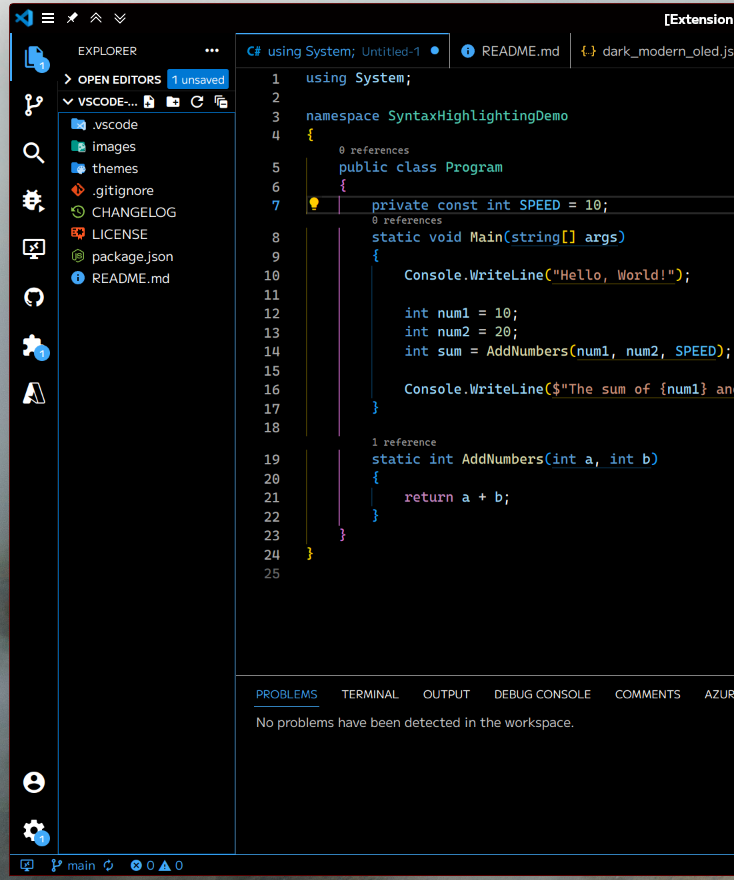
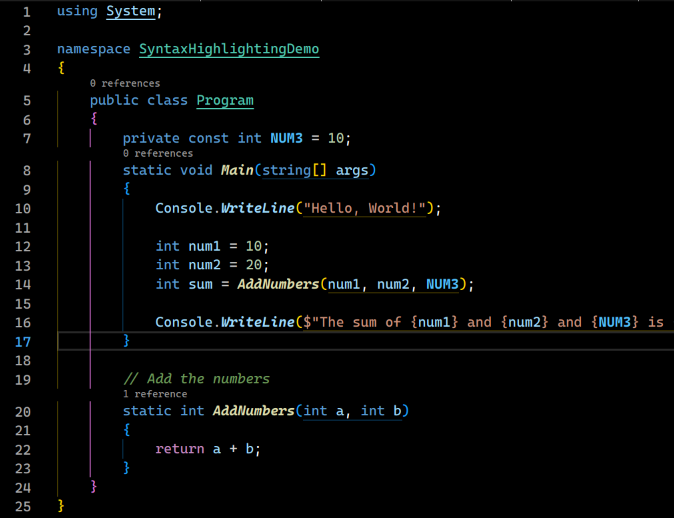
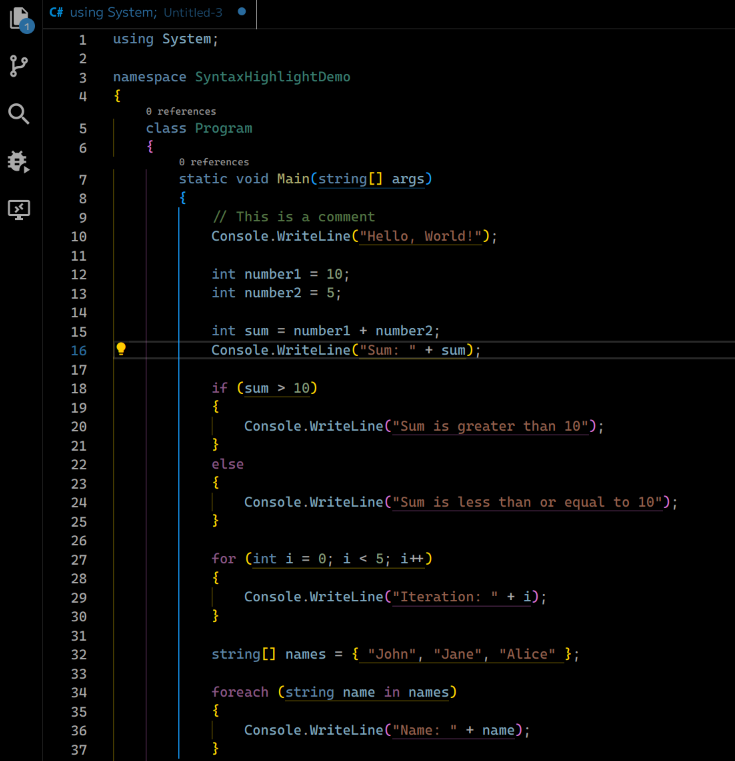

# Dark Modern (OLED Black) Theme Set

Visual Studio Code theme designed to be the "OLED Black" variant of the default
"Dark/Light Modern" themes shipped with the application; along with a few light themes.

The scope of this extension has changed: now offering other well-known syntax highlighting color schemes in OLED Black
variants. This may or may not be spun off into its own extension; an "OLED Black" extension collection would be introduced.

## Included Themes

All themes feature pitch black (#000) backgrounds and bright white foregrounds (#fff) unless otherwise noted. Syntax
color schemes are preserved, unless otherwise noted.

All themes have a stylized variant unless otherwise noted. Stylized variants have the following embellishments:
  - Constants and enums: bold
  - Functions: italic bold
  - Types/Classes: underline
  - Comments: italic

### Dark Modern (OLED Black)

#### Included Color Variants
- Red
- Orange
- Yellow
- Green
- Teal
- Purple
- Fuchsia
- White

### Dark Modern (OLED Black) Stylized

### Dim & Dim+

- Foreground white is darker.
- Accent color is muted.
- (Dim+) Syntax colors are muted.

### Light Modern (OLED) Saturated & Stylized

- Saturated is Light Modern with the syntax coloring more saturated. The primary goal is to make
  the syntax highlighting more distinct and readable overall. The only deviations are that the 
  comments are grey instead of green and function declarations are green instead of yellow.

(I happen to think the default light theme looks great as-is, though I may provide changes down the road that amp up the contrast a touch. I primarily wanted to provide a stylized counterpart.)

### Light Modern Grey (OLED)

- A less harsh version of Light Modern for bright displays.

### Ayu (OLED Black)

## Custom Colors

Since I cannot concievably make every color under the sun, [a reminder that you
can customize any theme using your settings.json](https://code.visualstudio.com/docs/getstarted/themes#_customizing-a-color-theme).

Below are the workbench attributes that have the accent color:

- activityBarBadge.background
- activityBar.foreground
- activityBar.activeBorder
- editorLineNumber.activeForeground
- notificationCenterHeader.background
- panelTitle.activeBorder
- panelTitle.activeForeground
- progressBar.background
- scrollbarSlider.activeBackground
- settings.modifiedItemIndicator
- checkbox.foreground
- statusBar.border
- statusBar.foreground
- statusBarItem.remoteForeground
- tab.activeForeground
- badge.background
- badge.foreground
- button.background
- button.foreground
- button.hoverBackground
- editorGutter.modifiedBackground
- focusBorder
- inputOption.activeBackground
- inputOption.activeBorder
- statusBar.focusBorder
- statusBarItem.focusBorder
- tab.activeBorderTop
- terminal.tab.activeBorder
- welcomePage.progress.foreground

There are no changes to syntax highlighting colors above.

## Most Recent Changes

- Added the following theme(s):
  - Light Modern Grey

See CHANGELOG for previous changes.

## Disclaimer

This is not designed to reduce "burn-in" on OLED screens. This is a very
high contrast themeset and could have the opposite effect (except Dim+). OLED, 
in this case, refers to the fact that the backgrounds are pitch-black with white
foregrounds.

## Contributing

I use VSCode daily but I do not use every facet, so there may be areas in these
themes that I did not give attention to if I didn't notice it.

If there's any area of the UI I have missed, or if a subsequent update changes
a background color or otherwise breaks the theme, feel free to submit an issue
or branch and propose a fix.
