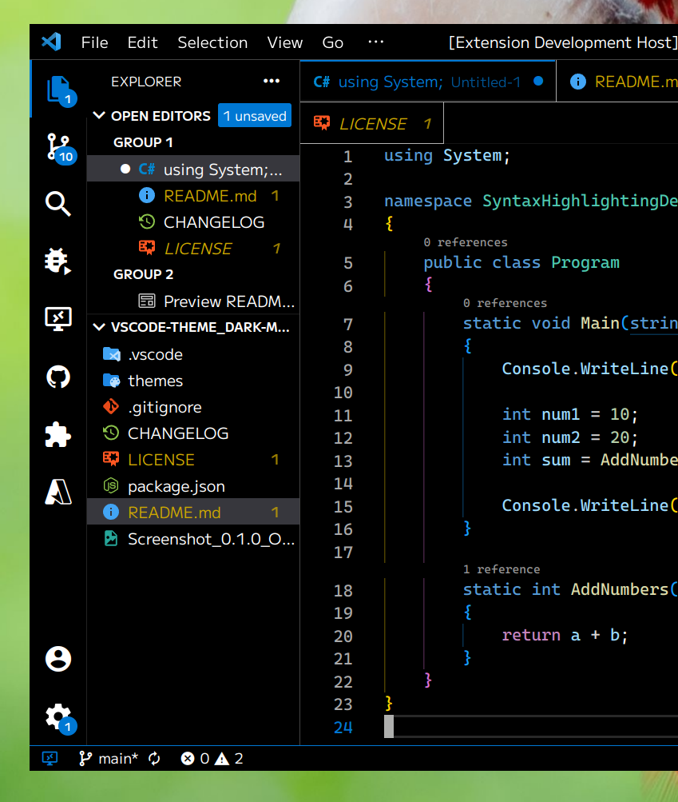

# Dark Modern (OLED Black) Theme Set

Visual Studio Code theme designed to be the "OLED Black" variant of the default
"Dark/Light Modern" themes shipped with the application.

## Included Themes

### Dark Modern (OLED Black)

My enhancements:

* Backgrounds are black (#000).
* Foregrounds are white (#fff).
* Sidebar foregrounds are bright white, while the selected foreground takes on
the accent color.
* Status bar shows status through *border color* rather than background color.
* Accent color is leaned into more to show active items. Inactive text is bright
white rather than greyed out.

## Roadmap

No concrete dates or plans, but I would like to add a few themes to the list
for a little variation (while remaining more-or-less faithful to the default).

* 0.1
  * Initial Release
* 0.2
  * Stylized variant
* 0.3
  * Neon Black + Stylized variant
* 0.4
  * Dim Black + Stylized variant
* 0.5
  * Accent color variants
  * Accent colorless variant ("High Contrast")
* ...?
* 1.0

## Disclaimer

This is not designed to reduce "burn-in" on OLED screens. This is a very
high contrast oriented theme and would have the opposite effect.

OLED, in this case, refers to the fact that the backgrounds are pitch-black.
The nomenclature derives from the fact that OLED screens are very good at
producing pure black and many UIs designed around OLED leverage this fact.
Further, "Dark theme" has come to refer to any theme that is darker, not black,
hence the initial need for the descriptor.

## Contributing

I use VSCode daily but I do not use every facet, so there are areas in the
theme I did not give attention to if I didn't notice it in the UI itself.

If there's any area of the UI I have missed, or if a subsequent update changes
a background color or otherwise breaks the theme, feel free to submit an issue
or branch and propose a fix.
